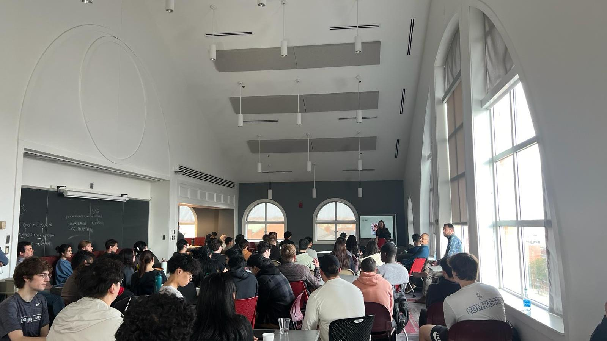

# 2024 OSU Quantitative Finance Competition

## Overview

The **2024 OSU Quantitative Finance Competition** was a highly competitive event in which our team of five, *The Algebros*, secured the **Gold Medal** for achieving the best statistical analysis and Sharpe ratio–adjusted return out of 15 teams.

Our trading simulation demonstrated significant portfolio growth, increasing from **$20K to $124K** over a 10-year period.

## Team Members

- Gabriel Tucker: [[GitHub](https://github.com/gabetucker2)] [[LinkedIn](https://www.linkedin.com/in/gabetucker2/)]
- Echo Li: [[GitHub](https://github.com/EcchoLi)]
- Nathan Bayer: [[GitHub](https://github.com/nathanbayer123)]
- Evelyn Z.: [[GitHub](https://github.com/EvelynZZH11)]
- Ryan R.: [[GitHub](https://github.com/RyanRunxianDu)]

## Announcement post and photos

## Project Timeline

### Abandoned Work (prior to deadline)

- **MultimodalSentimentStrategy**: Initially, we focused on creating a unified system to run all our algorithms through a single Python environment. However, we shifted away from this approach in favor of strategies that would produce more immediate results. We plan to revisit and expand this codebase for real-world stock trading once the hackathon concludes.

- **ACTRAttempt**: This was an experimental model attempting to implement the ACT-R cognitive architecture, a supervised learning algorithm, in an isolated environment. After evaluating its performance, we decided to abandon this approach due to the complexity and lack of intuitive explanatory power compared to other statistical models. We aim to complete and refine this model post-hackathon.

### Submitted Work

- **FeatureImportanceAnalysis**: This code was used to analyze the significance of various features in the dataset. Our findings contradicted our initial hypothesis, revealing that CL prices did not significantly impact DA prices.

- **Candlesticks**: A visualization tool designed to display the overall trends in the dataset, aiding in better understanding of the market behavior.

- **MultipleLinearRegression**: This algorithm was used to calculate the coefficients for our **MarketSentimentStrategy**. It was integral in determining how different features interacted and contributed to market predictions.

- **MarketSentimentStrategy**: A trading strategy based on market sentiment analysis, which achieved an average return of 20% (with leverage). This strategy was one of our key components, reflecting a solid understanding of market dynamics.

- **BrownianStrategy**: A simulation strategy based on Geometric Brownian Motion (GBM) and ordinary differential equations (ODEs). This approach produced an average return of 10.2% (with leverage), outperforming the money market.

---

Let me know if you encounter any issues accessing the scripts or need further clarification on any of the strategies!
