# 2024 OSU Quantitative Finance Competition

## Overview

The **2024 OSU Quantitative Finance Competition** was a competition in which our team secured the **Gold Medal** for achieving the best statistical analysis and Sharpe ratio–adjusted return out of 15 teams.

Our market sentiment strategy increased our **$10k** portfolio budget (with 2x leveraged return) to **$124k** through day trading over a 10-year period in our simulations.  After implementing additional revisions to improve accuracy, it increased a **$10k** portfolio budget (with 2x leveraged return) to **$114** over the same 10-year period.

## Team Members

- Gabriel Tucker: [[GitHub](https://github.com/gabetucker2)] [[LinkedIn](https://www.linkedin.com/in/gabetucker2/)]
- Echo Li: [[GitHub](https://github.com/EcchoLi)]
- Nathan Bayer: [[GitHub](https://github.com/nathanbayer123)] [[LinkedIn](http://linkedin.com/in/nathan-bayer)]

## Announcement post and photos


## Technologies Used

- **Python 3.11** – Primary programming language for all modeling, analysis, and simulation scripts
  - **random** and **statistics** libraries - Core logic for stochastic simulation and trial-based evaluation
  - **Pandas** – Data manipulation and preprocessing
  - **NumPy** – Numerical operations and matrix handling
  - **Matplotlib** – Data visualization (used for generating all plotted figures)
  - **Scikit-learn** – Machine learning framework used for:
    - `SelectKBest` feature selection
    - `RandomForestRegressor` for nonlinear feature importance
    - `MultipleLinearRegression` modeling
- **R + RStudio** – Alternate programming language for self-contained analysis
- **VSCode** – Main development environment for code collaboration
- **Git + GitHub** – Version control and public codebase hosting
- **CSV Imports/Manipulation + Microsoft Excel** – Historical financial data, some manually and some procedurally curated into CSVs

## Table of Contents
- Overview
- Team Members
- Announcement Post
- Technologies Used
- Table of Contents
- Foreword
- Submitted Work Timeline
  - Candlesticks
  - FeatureImportanceAnalysis
  - BrownianStrategy
  - MultipleLinearRegression
  - MarketSentimentStrategy

## Foreword

### Post Hoc Code Revisions

The only revisions made to our scripts after the competitions were in order to make the scripts capable of running in a repo clone's local environment without any changes, in case someone else would like to run the scripts for themselves.  We also slightly modified the titles of our existing graphs for sake of clarity in a non-video presentation format, and the market sentiment analysis code was overhauled to better account for real-world variables not accounted for in our original code and to provide improved analytics.

### Abandoned Work (prior to deadline)

- [**MultimodalSentimentStrategy**](AbandonedScripts/MultimodalAttempt): Initially, we focused on creating a unified system to run all our algorithms through a single Python environment for the sake of scalability and reducing boilerplate code between algorithms. However, we shifted away from this approach in favor of strategies that would produce more immediate results.

- [**ACTRAttempt**](AbandonedScripts/ACTRAttempt): This was an attempt at implement the py-ACTUP implementation of the ACT-R cognitive architecture, a supervised learning algorithm whose working memory module is a production system, in an isolated environment. We decided to abandon this approach due to how long it took to implement compared to other models.

## Submitted Work Timeline

## [**Candlesticks**](SubmittedScripts/Candlesticks): Surface-Level Analysis of Market Data

First, we decided to visualize the two datasets we were working with, using "candlestick" visualization method, so that we could have a baseline understanding of the market's behavior over the past decade and verify data integrity (which turned out to be useful, because one of the datasets we were using was incorrect).

  
  
  
  
  


---

## [**FeatureImportanceAnalysis**](SubmittedScripts/FeatureImportanceAnalysis): Hypothesis Testing & Parameter Diagnostics

## Intro

This code was used to perform feature importance analysis—a process for analyzing stock-related features' (i.e., parameters') predictive power for other causally-connected features. There were 5 features we included per dataset in our analysis:

* `Yesterday's closing price` (DAAdjCloseToday) *(in retrospect should have been better named)*
* `Today's closing price` (DACloseToday)
* `Today's highest price` (DAHighToday)
* `Today's lowest price` (DALowToday)
* `Today's trading volume` (DAVolumeToday)

We also only performed feature importance analysis on DAL stock feature importance because we were tasked with trading in Delta Airlines stocks, not crude oil stocks. So by performing feature importance on DAL features, we analyze how those features are affected by A) other available DAL features and B) available CL features.

It is also worth noting we originally attempted to create a modular framework for various feature importance analysis algorithms (available in our project code), but dropped this due to time constraints.

### SelectKBest

SelectKBest is the algorithm we initially decided on to perform feature importance analysis. The algorithm ranks features by their individual linear relationship with the target variable, using an F-statistic derived from univariate linear regression.

We used SelectKBest to quickly identify features with the strongest direct signal, without accounting for interactions or redundancy.


We were unsatisfied with these results since it revealed such negligible differences between all features except today's trading volume, so we decided to use an alternative feature importance analysis algorithm in hopes that it might yield something else interesting before analyzing our feature importance analysis outputs:

### RandomForest

Random Forest creates a set of decision trees that captures nonlinear dependencies and feature interactions. It evaluates feature importance based on how much each feature reduces prediction error.

We used Random Forest to uncover complex relationships that SelectKBest might miss, especially where combinations of features or nonlinearity are involved.


This seems to have confirmed our SelectKBest results, increasing the importance of DAOpenToday on corresponding features.

### Analyzing outputs

`DAOpenToday` is far and away the strongest predictor of other features, aside from volume. This makes sense at face value, but let's explain the volume's discrepancy:

In the case of volume, in which case yesterday's opening price is more impactful (according to RF). We can infer this is due to how increased variability in DAL stock trading implies the market implies some sort of volatility with current events. Latent variables might account for why yesterday's opening price is more impactful than today's opening price on predicting today's trading volume.

The main other observation is the feature importance strength for parameters of *non* `DAOpenToday` features.  Let's list out the importance score range of each CL feature for predicting DA features:

#### SelectKBest

* DAAdjCloseToday: 10<sup>2</sup> - 10<sup>3</sup>
* DACloseToday: 10<sup>2</sup> - 10<sup>3</sup>
* DAHighToday: 10<sup>2</sup> - 10<sup>3</sup>
* DACloseToday: 10<sup>2</sup> - 10<sup>3</sup>
* DAVolumeToday: 10<sup>1</sup> - 10<sup>2</sup>

#### RandomForest

* DAAdjCloseToday: 10<sup>-1</sup> - 10<sup>-2</sup>
* DACloseToday: 10<sup>-3</sup>
* DAHighToday: 10<sup>-4</sup> - 10<sup>-3</sup>
* DACloseToday: 10<sup>-2</sup> - 10<sup>-3</sup>
* DAVolumeToday: 10<sup>-2</sup> - 10<sup>0</sup>

RandomForest's feature importance analysis is much better at delineating low-importance features from high-importance features.  As a result, let's focus on RandomForest results.

`DAAdjCloseToday` has very high non-DAOpenToday prediction importance (relative to other parameters).

`DACloseToday` shows moderate non-DAOpenToday prediction importance, but noticeably weaker than DAAdjCloseToday. This suggests that while today's closing price is influenced by other factors, it does not aggregate predictive signals as robustly as the adjusted close.

`DAHighToday` has extremely low predictive power relative to other parameters, consistent with the intuition that intraday highs are more susceptible to random market fluctuations and less structurally determined by other features.

`DALowToday` exhibits low-to-moderate predictive power, slightly stronger than DAHighToday but still weaker than closing prices. This suggests that low prices may have some anchored dependency on broader trading conditions but are still less structured than closing metrics.

`DAVolumeToday` has high predictive power for the same reasons discussed earlier: market volume is influenced by latent volatility signals, which are more closely connected to prior pricing and sentiment factors (such as yesterday’s opening price) than to static technical indicators.

---

## [**BrownianStrategy**](SubmittedScripts/BrownianStrategy): Stochastic Price Simulation

A simulation strategy based on Geometric Brownian Motion (GBM) and ordinary differential equations. This approach produced an average portfolio growth of 2.89x over 10 years (with 2x leverage), outperforming the S&P 500 market, which has roughly ~2.59× growth per 10 years.

One trial (x-axis representing days passed within one trial):


1000 trials (x-axis representing final value of each trial) (average final value: $28873.23):


## MultipleLinearRegression: Parameter Retrieval for Market Sentiment Strategy

- [**MultipleLinearRegression**](SubmittedScripts/MultipleLinearRegression):

MLR was used to calculate the coefficients for our market sentiment analysis.  It was integral in determining how different features interacted and contributed to market predictions, and it was based on the first 1350 days from the dataset.


Then implemented in our MarketSentimentStrategy script:


Finally, we manually edited our combined.csv file using Microsoft Excel functionality, that is used in the MarketSentimentStrategy model.  The new csv file features "lag" data for each day based on parameters in this script, allowing us to analyze market sentiment on a day-by-day basis.

---

## [**MarketSentimentStrategy**](SubmittedScripts/MarketSentimentStrategy): Sentiment-Based Trading Logic

A trading strategy based on market sentiment analysis over a 10-year was tested on data that was not used in our MLR parameter estimation to avoid data leakage.  Random sampling might cause our results to be unrealistically high due to its tendency to avoid persistent negative streaks in the market, so we decided that in order to maximize realism with the limited data we had been provided, we would settle on serial model for the remaining days in the 10-year period not used for training, selecting 1 year period at a time within each trial.

The center-most logic in our algorithm is the following:

> If the lowest price of the day is below the stop price, then we sell before the day ends to minimize daily losses:
```
if low_da < stopPrice:
  sellPrice = stopPrice
```

> If the estimated highest price of the day is hit, then we sell at the high point before the day ends:
```
else if high_da >= highestEstimate:
  sellPrice = highestEstimate
```

> And otherwise, we simply sell at the closing price at the end of the day between the stop price and our high estimate, solidifying gains:
```
else:
  sellPrice = close_da
```

But a key problem we run into with this approach is how based on our data not providing within-day stock information, there are many cases where both the low price of the day is below the stop price and the highest price of the day, meaning we don't know whether the model hit our stop price or our high estimate first.  As a result, we need to add a new first condition which estimates the probability of either the stop price, or the high estimate, being hit first, based on market data:
```
if low_da < stopPrice and high_da >= highestEstimate:
  sellPrice = stopPrice or highestEstimate # Randomly chosen based on the probability of stopPrice vs highestEstimate being hit first
```

So the final core logic in the model was:

```
if low_da < stopPrice and high_da >= highestEstimate:
  sellPrice = stopPrice or highestEstimate # Randomly chosen based on the probability of stopPrice vs highestEstimate being hit first
else if low_da < stopPrice:
  sellPrice = stopPrice
else if high_da >= highestEstimate:
  sellPrice = highestEstimate
else:
  sellPrice = close_da
```

By the time we implemented this model, we were about to run out of time in the competition, so we arbitrarily decided upon a 2% drop stop rule, which gave us our original result of **$124k** returns over 10 years with 2x leverage and won us the competition.  But upon expanding the script after the competition (also to account for more real-world factors like trading fees, alpha fading, stop-sell slipping, and missing a cashout at a high point due to trading lag, which we don't have time to go into here), we can take a deeper look at how various stop auto-sell factors affect stock return rate below (for instance, a 0.5 stop loss implies selling shares after a 5% drop from the opening/buy price for the day):

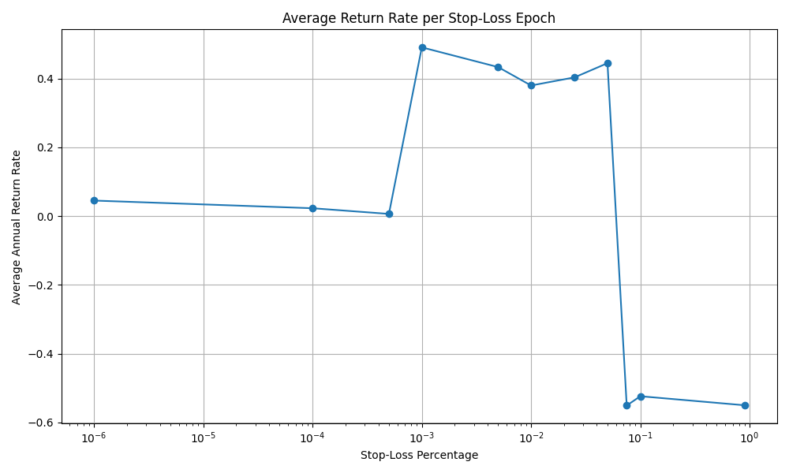

Taking a closer look at each epoch (with 300 trials per epoch):

### Epoch with stop-loss: 0.000001
```
Median Final Money: 8,075.84
Min Final Money: 2,289.92
Max Final Money: 41,739.32
Std Dev Final Money: 6,367.27
Mean Growth Factor: 1.0453
Mean Avg delta: -0.0103
Mean Std Dev delta: 0.9407
Mean % Above Buy: 41.83%
Mean % Below Buy: 58.09%
Stop-Loss Hit Rate: 37.70%
Mean High-Low Dev: 1.2875 (3.42%)
Geometric Growth: 0.88
Projected Final Money After 10 Years: 2,928.67
```
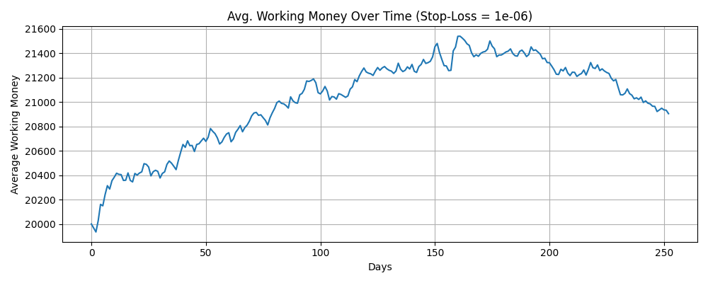

### Epoch with stop-loss: 0.0001
```
Median Final Money: 8,600.41
Min Final Money: 3,206.11
Max Final Money: 43,583.41
Std Dev Final Money: 6,049.53
Mean Growth Factor: 1.0230
Mean Avg delta: -0.0091
Mean Std Dev delta: 0.9348
Mean % Above Buy: 42.19%
Mean % Below Buy: 57.76%
Stop-Loss Hit Rate: 40.48%
Mean High-Low Dev: 1.2771 (3.40%)
Geometric Growth: 0.89
Projected Final Money After 10 Years: 3,083.71
```
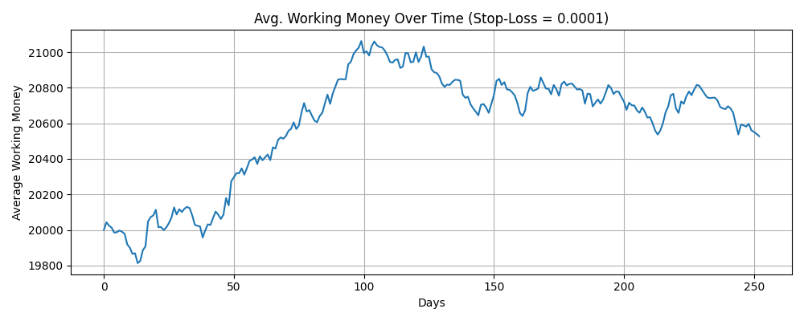

### Epoch with stop-loss: 0.0005
```
Median Final Money: 8,600.05
Min Final Money: 2,398.91
Max Final Money: 38,461.60
Std Dev Final Money: 5,753.56
Mean Growth Factor: 1.0065
Mean Avg delta: -0.0118
Mean Std Dev delta: 0.9378
Mean % Above Buy: 42.08%
Mean % Below Buy: 57.85%
Stop-Loss Hit Rate: 41.27%
Mean High-Low Dev: 1.2918 (3.42%)
Geometric Growth: 0.87
Projected Final Money After 10 Years: 2,586.10
```
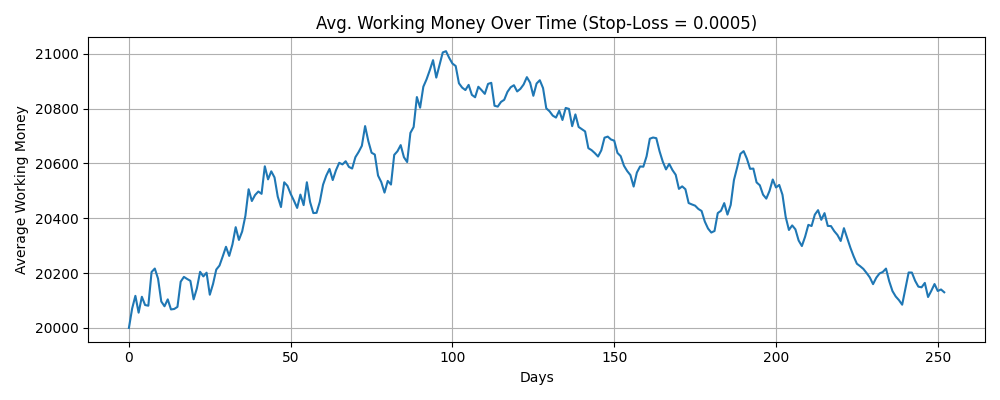

### Analysis (1e-06 to 0.0005)
The above three epoch returns attenuated over time due to our alpha decay rate, which causes our alpha parameter to reduce in predictive accuracy over time due to real-world market factors.

### Epoch with stop-loss: 0.001
```
Median Final Money: 12,765.94
Min Final Money: 3,196.44
Max Final Money: 55,284.33
Std Dev Final Money: 8,637.83
Mean Growth Factor: 1.4907
Mean Avg delta: 0.0433
Mean Std Dev delta: 1.0568
Mean % Above Buy: 44.41%
Mean % Below Buy: 55.54%
Stop-Loss Hit Rate: 54.76%
Mean High-Low Dev: 1.3090 (3.47%)
Geometric Growth: 1.28
Projected Final Money After 10 Years: 113,596.46
```
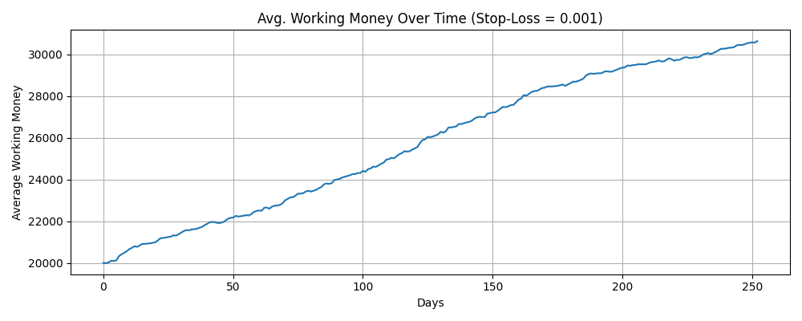

### Epoch with stop-loss: 0.005
```
Median Final Money: 12,795.96
Min Final Money: 2,596.96
Max Final Money: 61,773.92
Std Dev Final Money: 7,889.64
Mean Growth Factor: 1.4333
Mean Avg delta: 0.0379
Mean Std Dev delta: 1.0484
Mean % Above Buy: 44.46%
Mean % Below Buy: 55.48%
Stop-Loss Hit Rate: 53.57%
Mean High-Low Dev: 1.2852 (3.40%)
Geometric Growth: 1.24
Projected Final Money After 10 Years: 88,759.39
```
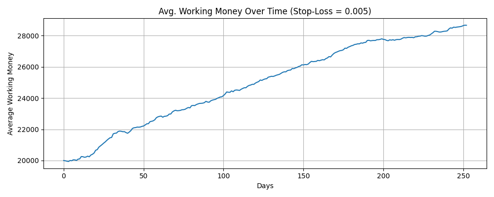

### Epoch with stop-loss: 0.01
```
Median Final Money: 12,476.00
Min Final Money: 2,303.87
Max Final Money: 46,480.25
Std Dev Final Money: 7,445.87
Mean Growth Factor: 1.3798
Mean Avg delta: 0.0358
Mean Std Dev delta: 1.0405
Mean % Above Buy: 44.39%
Mean % Below Buy: 55.57%
Stop-Loss Hit Rate: 52.38%
Mean High-Low Dev: 1.2923 (3.43%)
Geometric Growth: 1.20
Projected Final Money After 10 Years: 61,460.12
```
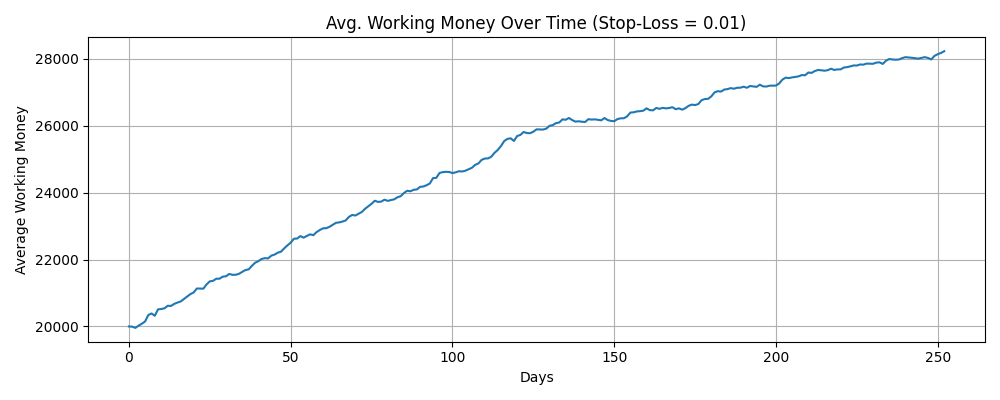

### Epoch with stop-loss: 0.025
```
Median Final Money: 12,890.01
Min Final Money: 1,724.19
Max Final Money: 44,288.66
Std Dev Final Money: 7,233.70
Mean Growth Factor: 1.4035
Mean Avg delta: 0.0359
Mean Std Dev delta: 1.0409
Mean % Above Buy: 44.33%
Mean % Below Buy: 55.60%
Stop-Loss Hit Rate: 50.79%
Mean High-Low Dev: 1.2972 (3.42%)
Geometric Growth: 1.23
Projected Final Money After 10 Years: 76,809.84
```
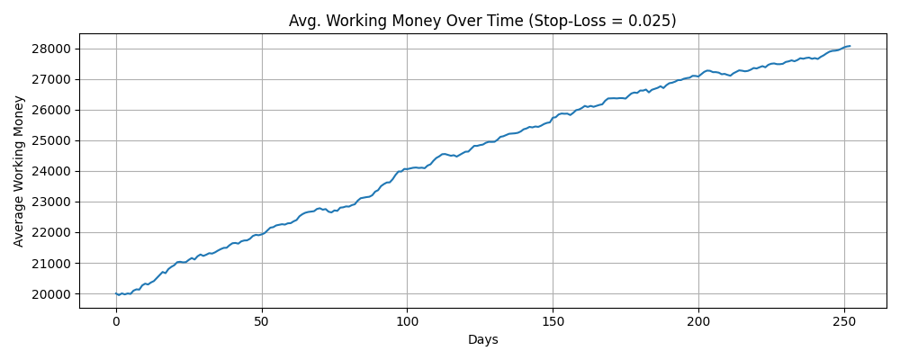

### Epoch with stop-loss: 0.05
```
Median Final Money: 12,487.45
Min Final Money: 2,967.02
Max Final Money: 58,694.50
Std Dev Final Money: 8,707.36
Mean Growth Factor: 1.4447
Mean Avg delta: 0.0374
Mean Std Dev delta: 1.0451
Mean % Above Buy: 44.52%
Mean % Below Buy: 55.41%
Stop-Loss Hit Rate: 53.17%
Mean High-Low Dev: 1.3010 (3.45%)
Geometric Growth: 1.22
Projected Final Money After 10 Years: 74,642.72
```
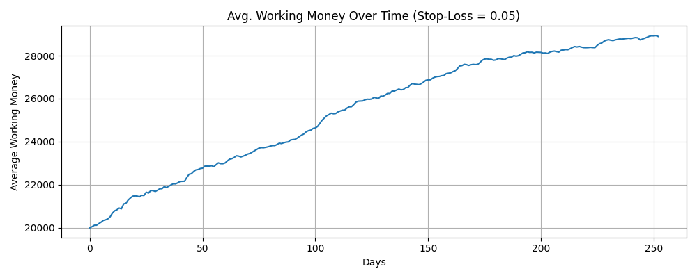

### Analysis (0.001 to 0.05)
Somewhere between a 0.0005 and 0.001 stop loss rate seems to be a threshold at which point we start making positive returns.

The above three stocks did not attenuate returns over time (though their return increase decelerated) likely due to the fact their stop loss factors were above the return threshold.

### Epoch with stop-loss: 0.075
```
Median Final Money: 2,386.33
Min Final Money: 25.55
Max Final Money: 39,920.31
Std Dev Final Money: 5,703.53
Mean Growth Factor: 0.4494
Mean Avg delta: 0.0375
Mean Std Dev delta: 1.0561
Mean % Above Buy: 44.21%
Mean % Below Buy: 55.73%
Stop-Loss Hit Rate: 51.19%
Mean High-Low Dev: 1.2970 (3.42%)
Geometric Growth: 0.21
Projected Final Money After 10 Years: 0.00
```
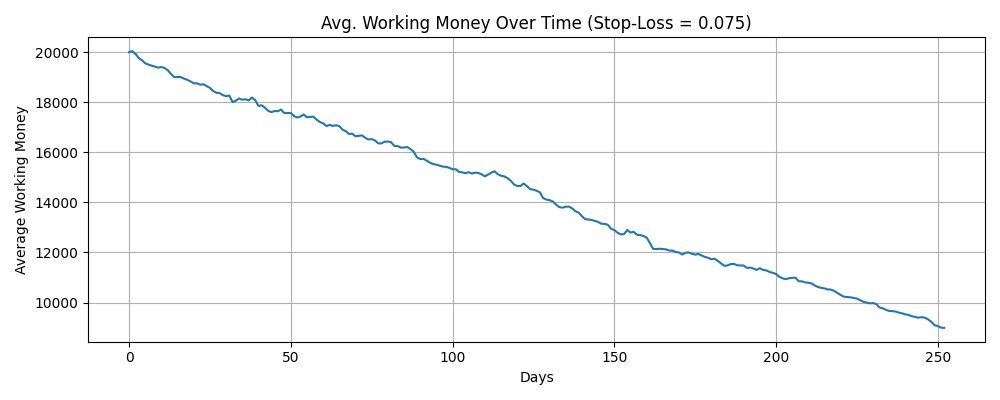


### Epoch with stop-loss: 0.1
```
Median Final Money: 2,669.37
Min Final Money: 22.97
Max Final Money: 33,525.21
Std Dev Final Money: 5,453.48
Mean Growth Factor: 0.4766
Mean Avg delta: 0.0408
Mean Std Dev delta: 1.0579
Mean % Above Buy: 44.35%
Mean % Below Buy: 55.60%
Stop-Loss Hit Rate: 50.00%
Mean High-Low Dev: 1.2991 (3.44%)
Geometric Growth: 0.23
Projected Final Money After 10 Years: 0.00
```
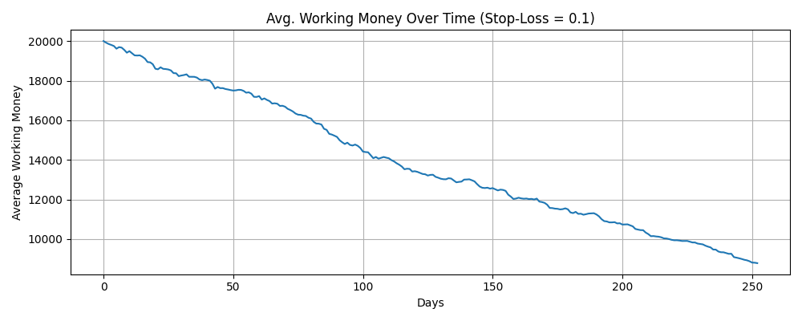

### Epoch with stop-loss: 0.9
```
Median Final Money: 2,290.40
Min Final Money: 0.37
Max Final Money: 50,372.33
Std Dev Final Money: 6,383.13
Mean Growth Factor: 0.4765
Mean Avg delta: 0.0384
Mean Std Dev delta: 1.0623
Mean % Above Buy: 44.33%
Mean % Below Buy: 55.61%
Stop-Loss Hit Rate: 55.56%
Mean High-Low Dev: 1.3152 (3.46%)
Geometric Growth: 0.21
Projected Final Money After 10 Years: 0.00
```
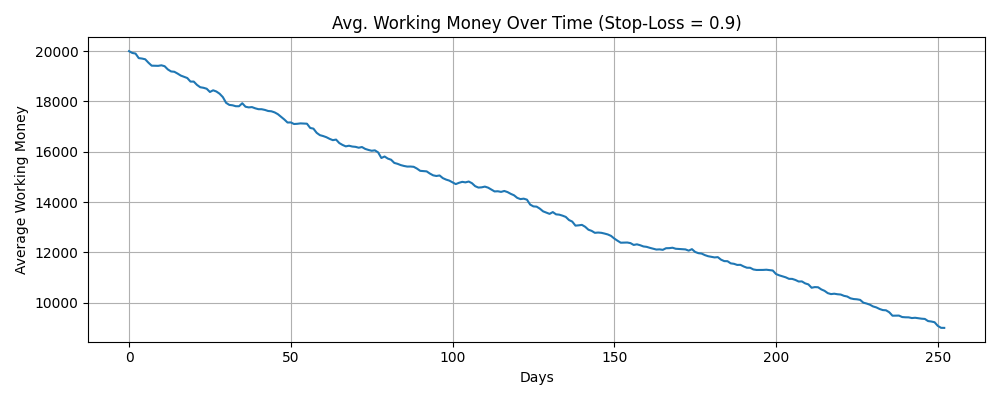

### Analysis (0.075 to 0.9)
Somewhere between 0.05 and 0.075 seems to be a threshold at which point returns again become negative.  By the time the stop loss sell rate is 10%, 

### Final Analysis
With all said and done, a stop loss sell rate of 0.001 (sell after a 0.1% drop from the opening price) yielded $113,596.46 returns after 10 years, a $103,596.46 and 1135.96% increase from our original $10,000, significantly outperforming the S&P 500's ~$25,900 returns after 10 years.  This strategy was significantly riskier due to the all-in 2x-leveraged nature of our investments, which is reflected in how with a first-year standard deviation of $8,637.83 and first-year median returns of $12,765.94, there is a ~37% chance of net losses in the first year.  But this could be mitigated, if we decided to return to this project, through the implementation of additional safety measures depending on the client's risk to mitigate loss chance at the expense of higher possible payoffs.
