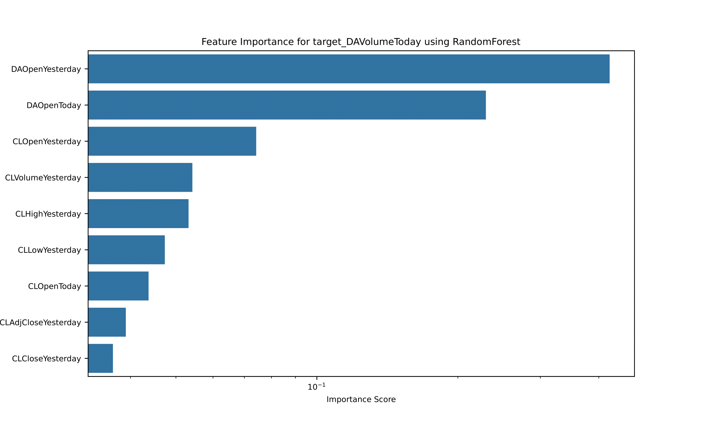

# 2024 OSU Quantitative Finance Competition

## Overview

The **2024 OSU Quantitative Finance Competition** was a competition in which our team secured the **Gold Medal** for achieving the best statistical analysis and Sharpe ratio–adjusted return out of 15 teams.

Our models increased our **$10k** portfolio budget (with 2x leveraged return) to **$124K** through day trading over a 10-year period in our simulations.

## Team Members

- Gabriel Tucker: [[GitHub](https://github.com/gabetucker2)] [[LinkedIn](https://www.linkedin.com/in/gabetucker2/)]
- Echo Li: [[GitHub](https://github.com/EcchoLi)]
- Nathan Bayer: [[GitHub](https://github.com/nathanbayer123)] [[LinkedIn](http://linkedin.com/in/nathan-bayer)]

## Announcement post and photos

## Technologies Used

- **Python 3.11** – Primary programming language for all modeling, analysis, and simulation scripts
  - **random** and **statistics** libraries - Core logic for stochastic simulation and trial-based evaluation
  - **Pandas** – Data manipulation and preprocessing
  - **NumPy** – Numerical operations and matrix handling
  - **Matplotlib** – Data visualization (used for generating all plotted figures)
  - **Scikit-learn** – Machine learning framework used for:
    - `SelectKBest` feature selection
    - `RandomForestRegressor` for nonlinear feature importance
    - `MultipleLinearRegression` modeling
- **R + RStudio** – Alternate programming language for self-contained analysis
- **VSCode** – Main development environment for code collaboration
- **Git + GitHub** – Version control and public codebase hosting
- **CSV Imports/Manipulation + Microsoft Excel** – Historical financial data, some manually and some procedurally curated into CSVs

## Foreword

### Post Hoc Code Revisions

The only revisions made to our scripts after the competitions were in order to make the scripts capable of running in a repo clone's local environment without any changes, in case someone else would like to run the scripts for themselves.  We also slightly modified the titles of our existing graphs for sake of clarity in a non-video presentation format, and the market sentiment analysis code was slightly revised for ease-of-use by people unfamiliar with the script.

### Abandoned Work (prior to deadline)

- [**MultimodalSentimentStrategy**](AbandonedScripts/MultimodalAttempt): Initially, we focused on creating a unified system to run all our algorithms through a single Python environment for the sake of scalability and reducing boilerplate code between algorithms. However, we shifted away from this approach in favor of strategies that would produce more immediate results.

- [**ACTRAttempt**](AbandonedScripts/ACTRAttempt): This was an attempt at implement the py-ACTUP implementation of the ACT-R cognitive architecture, a supervised learning algorithm whose working memory module is a production system, in an isolated environment. We decided to abandon this approach due to how long it took to implement compared to other models.

## Submitted Work Timeline

## 📈 [**Candlesticks**](SubmittedScripts/Candlesticks): Surface-Level Analysis of Market Data

First, we decided to visualize the two datasets we were working with, using "candlestick" visualization method, so that we could have a baseline understanding of the market's behavior over the past decade and verify data integrity (which turned out to be useful, because one of the datasets we were using was incorrect).

  
  
  
  
  

---

## 🧠 [**FeatureImportanceAnalysis**](SubmittedScripts/FeatureImportanceAnalysis): Hypothesis Testing & Parameter Diagnostics

## Intro

This code was used to perform feature importance analysis—a process for analyzing stock-related features' (i.e., parameters') predictive power for other causally-connected features. There were 5 features we included per dataset in our analysis:

* `Yesterday's closing price` (DAAdjCloseToday) *(in retrospect should have been better named)*
* `Today's closing price` (DACloseToday)
* `Today's highest price` (DAHighToday)
* `Today's lowest price` (DALowToday)
* `Today's trading volume` (DAVolumeToday)

We also only performed feature importance analysis on DAL stock feature importance because we were tasked with trading in Delta Airlines stocks, not crude oil stocks. So by performing feature importance on DAL features, we analyze how those features are affected by A) other available DAL features and B) available CL features.

It is also worth noting we originally attempted to create a modular framework for various feature importance analysis algorithms (available in our project code), but dropped this due to time constraints.

### SelectKBest

SelectKBest is the algorithm we initially decided on to perform feature importance analysis. The algorithm ranks features by their individual linear relationship with the target variable, using an F-statistic derived from univariate linear regression.

We used SelectKBest to quickly identify features with the strongest direct signal, without accounting for interactions or redundancy.

We were unsatisfied with these results since it revealed such negligible differences between all features except today's trading volume, so we decided to use an alternative feature importance analysis algorithm in hopes that it might yield something else interesting before analyzing our feature importance analysis outputs:

### RandomForest

Random Forest creates a set of decision trees that captures nonlinear dependencies and feature interactions. It evaluates feature importance based on how much each feature reduces prediction error.

We used Random Forest to uncover complex relationships that SelectKBest might miss, especially where combinations of features or nonlinearity are involved.

This seems to have confirmed our SelectKBest results, increasing the importance of DAOpenToday on corresponding features.

### Analyzing outputs

`DAOpenToday` is far and away the strongest predictor of other features, aside from volume. This makes sense at face value, but let's explain the volume's discrepancy:

In the case of volume, in which case yesterday's opening price is more impactful (according to RF). We can infer this is due to how increased variability in DAL stock trading implies the market implies some sort of volatility with current events. Latent variables might account for why yesterday's opening price is more impactful than today's opening price on predicting today's trading volume.

The main other observation is the feature importance strength for parameters of *non* `DAOpenToday` features.  Let's list out the importance score range of each CL feature for predicting DA features:

#### SelectKBest

* DAAdjCloseToday: 102 - 103
* DACloseToday: 102 - 103
* DAHighToday: 102 - 103
* DACloseToday: 102 - 103
* DAVolumeToday: 101 - 102

#### RandomForest

* DAAdjCloseToday: 10-1 - 10-2
* DACloseToday: 10-3
* DAHighToday: 10-4 - 10-3
* DACloseToday: 10-2 - 10-3
* DAVolumeToday: 10-2 - 100

RandomForest's feature importance analysis is much better at delineating low-importance features from high-importance features.  As a result, let's focus on RandomForest results.

`DAAdjCloseToday` has very high non-DAOpenToday prediction importance (relative to other parameters).

`DACloseToday` shows moderate non-DAOpenToday prediction importance, but noticeably weaker than DAAdjCloseToday. This suggests that while today's closing price is influenced by other factors, it does not aggregate predictive signals as robustly as the adjusted close.

`DAHighToday` has extremely low predictive power relative to other parameters, consistent with the intuition that intraday highs are more susceptible to random market fluctuations and less structurally determined by other features.

`DALowToday` exhibits low-to-moderate predictive power, slightly stronger than DAHighToday but still weaker than closing prices. This suggests that low prices may have some anchored dependency on broader trading conditions but are still less structured than closing metrics.

`DAVolumeToday` has high predictive power for the same reasons discussed earlier: market volume is influenced by latent volatility signals, which are more closely connected to prior pricing and sentiment factors (such as yesterday’s opening price) than to static technical indicators.

---

## 📉 [**BrownianStrategy**](SubmittedScripts/BrownianStrategy): Stochastic Price Simulation

- [**BrownianStrategy**](SubmittedScripts/BrownianStrategy):

A simulation strategy based on Geometric Brownian Motion (GBM) and ordinary differential equations. This approach produced an average return of 88.73% (with 2x leverage), outperforming the money market, but not as markedly as our market sentiment analysis strategy.

One trial (x-axis representing days passed within one trial):

1000 trials (x-axis representing final value of each trial) (average final value: $28873.23):

## 📊 MultipleLinearRegression: Parameter Retrieval for Market Sentiment Strategy

- [**MultipleLinearRegression**](SubmittedScripts/MultipleLinearRegression):

MLR was used to calculate the coefficients for our market sentiment analysis.  It was integral in determining how different features interacted and contributed to market predictions.

Then implemented in our MarketSentimentStrategy script:

Finally, we manually edited our combined.csv file using Microsoft Excel functionality, that is used in the MarketSentimentStrategy model.  The new csv file features "lag" data for each day based on parameters in this script, allowing us to analyze market sentiment on a day-by-day basis.

---

## 🧭 MarketSentimentStrategy: Sentiment-Based Trading Logic

- [**MarketSentimentStrategy**](SubmittedScripts/MarketSentimentStrategy):

A trading strategy based on market sentiment analysis, which achieved an average return of 23% with 2x leverage, amounting to 130% growth over a 10-year period.  This was tested on the data that was not used in our MLR parameter estimation to avoid data leakage.

Median Final Money: 22,920.22  
Geometric Mean Growth Factor: 2.31  
Compounded 10-Year Projection: 23,113.19  

---
